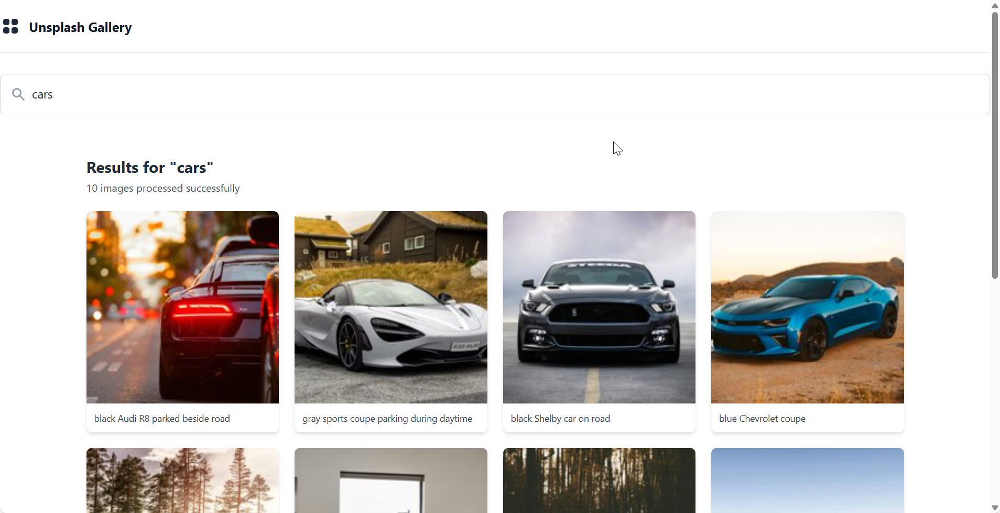

# 🔍 ImageSearch - Full-Stack Image Search Application

A modern full-stack web application that searches and processes images from Unsplash API with intelligent resizing and parallel processing capabilities.

## Preview



_Image search interface showing results from Unsplash API_

## ✨ Features

- **Smart Image Search**: Query Unsplash's vast image library
- **Automatic Image Processing**: Downloads and resizes images in two versions (1024px & 256px)
- **Parallel Processing**: Processes up to 3 images concurrently for optimal performance
- **Error Resilience**: Retry logic with exponential backoff, individual image errors don't stop others
- **Responsive UI**: Beautiful, mobile-friendly interface with lazy loading
- **Real-time Feedback**: Loading states, error messages, and processing statistics
- **Image Preview**: Click to view larger versions in a modal
- **Request Cancellation**: Automatic abort of previous searches

## 🏗️ Architecture

### Backend (ASP.NET Core 8.0)

- **Clean Architecture** with separation of concerns
- **Dependency Injection** for testability and maintainability
- **Retry Policies** using Polly for transient failures
- **Image Processing** with SixLabors.ImageSharp
- **Global Exception Handling** with structured error responses
- **Static File Serving** for processed images
- **Comprehensive Testing** (Unit + Integration tests)

### Frontend (React + TypeScript)

- **Component-Based Architecture** with custom hooks
- **Type-Safe** with full TypeScript coverage
- **Modern Styling** using Tailwind CSS
- **Performance Optimized** with lazy loading and request cancellation
- **Accessible** with ARIA labels and keyboard support

## 🚀 Quick Start

### Prerequisites

- [.NET 8.0 SDK](https://dotnet.microsoft.com/download/dotnet/8.0)
- [Node.js 18+](https://nodejs.org/) and npm
- [Unsplash API Key](https://unsplash.com/developers) (free tier: 50 requests/hour)

### Backend Setup

1. **Navigate to the API project:**

   ```bash
   cd ImageSearch.Api
   ```

2. **Configure your Unsplash API key using User Secrets:**

   ```bash
   dotnet user-secrets init
   dotnet user-secrets set "Unsplash:ApiKey" "YOUR_UNSPLASH_API_KEY"
   ```

3. **Restore dependencies and run:**

   ```bash
   dotnet restore
   dotnet run
   ```

   The API will start at `https://localhost:5001` (or `http://localhost:5000`)

### Frontend Setup

1. **Navigate to the frontend project:**

   ```bash
   cd ImageSearch.FrontEnd/image-search
   ```

2. **Install dependencies:**

   ```bash
   npm install
   ```

3. **Configure the API URL (optional):**

   Create a `.env` file based on `.env.example`:

   ```bash
   cp .env.example .env
   ```

   Update the API URL if needed:

   ```env
   VITE_API_BASE_URL=http://localhost:5000/api
   ```

4. **Start the development server:**

   ```bash
   npm run dev
   ```

   The app will open at `http://localhost:5173`

## 🧪 Running Tests

### Backend Tests

```bash
# Run all tests
dotnet test

# Run unit tests only
dotnet test ImageSearch.Api.Tests

# Run integration tests only
dotnet test ImageSearch.Api.Integration

# With coverage
dotnet test /p:CollectCoverage=true
```

### Frontend Tests

```bash
cd ImageSearch.FrontEnd/image-search

# Run tests
npm run test

# Run tests once (CI mode)
npm run test:run

# Run tests with UI
npm run test:ui
```

## 📁 Project Structure

```
ImageSearch/
├── ImageSearch.Api/                    # ASP.NET Core Web API
│   ├── Configuration/                  # Settings classes
│   ├── Controllers/                    # API endpoints
│   ├── Domain/                         # Data models
│   ├── Exceptions/                     # Custom exceptions
│   ├── Middleware/                     # Global exception handler
│   ├── Services/                       # Business logic
│   └── Program.cs                      # App configuration
├── ImageSearch.Api.Tests/              # Unit tests
├── ImageSearch.Api.Integration/        # Integration tests
├── ImageSearch.FrontEnd/image-search/  # React TypeScript app
│   ├── src/
│   │   ├── components/                 # React components
│   │   ├── hooks/                      # Custom React hooks
│   │   ├── services/                   # API integration
│   │   ├── types/                      # TypeScript types
│   │   └── App.tsx                     # Main component
│   └── package.json
└── ImageSearch.sln                     # Visual Studio solution
```

## 🔌 API Endpoints

### `POST /api/images/search`

Search and process images from Unsplash.

**Request:**

```json
{
  "searchQuery": "mountains"
}
```

**Response:**

```json
{
  "searchQuery": "mountains",
  "totalProcessed": 8,
  "totalFailed": 2,
  "processedImages": [
    {
      "success": true,
      "imageId": "abc123",
      "thumbnailUrl": "/images/abc123_thumb.jpg",
      "smallImageUrl": "/images/abc123_small.jpg",
      "altDescription": "Mountain landscape",
      "description": "Beautiful mountain view"
    }
  ]
}
```

### `GET /api/images/{filename}`

Retrieve processed images (served as static files).

## ⚙️ Configuration

### Backend Configuration (appsettings.json)

```json
{
  "Unsplash": {
    "ApiKey": "" // Set via user secrets or environment variable
  },
  "ImageProcessing": {
    "OutputDirectory": "processed-images",
    "MaxConcurrency": 3,
    "SmallImageDimension": 1024,
    "ThumbnailDimension": 256
  }
}
```

## 🛠️ Technology Stack

### Backend

- **Framework**: ASP.NET Core 8.0
- **Image Processing**: SixLabors.ImageSharp 3.1.12
- **Resilience**: Polly 10.0.0
- **Testing**: xUnit 2.9.3, Moq 4.20.72
- **API Documentation**: Swashbuckle (Swagger/OpenAPI)

### Frontend

- **Framework**: React 19.2.0
- **Language**: TypeScript 5.9.3
- **Build Tool**: Vite 7.2.4
- **Styling**: Tailwind CSS 4.1.17
- **Icons**: React Icons 5.5.0

## 🚀 Deployment

### Backend Deployment

1. Configure production `appsettings.Production.json`
2. Set environment variables for API keys
3. Update CORS to allow only your frontend domain
4. Deploy to Azure App Service, AWS, or containerized environment

### Frontend Deployment

1. Build the production bundle: `npm run build`
2. Deploy the `dist` folder to Netlify, Vercel, or similar
3. Update `VITE_API_BASE_URL` to point to your production API

## 📄 License

This project is licensed under the MIT License.
